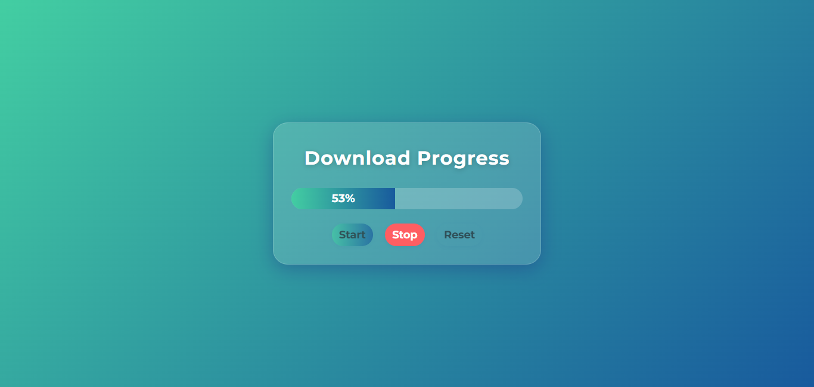
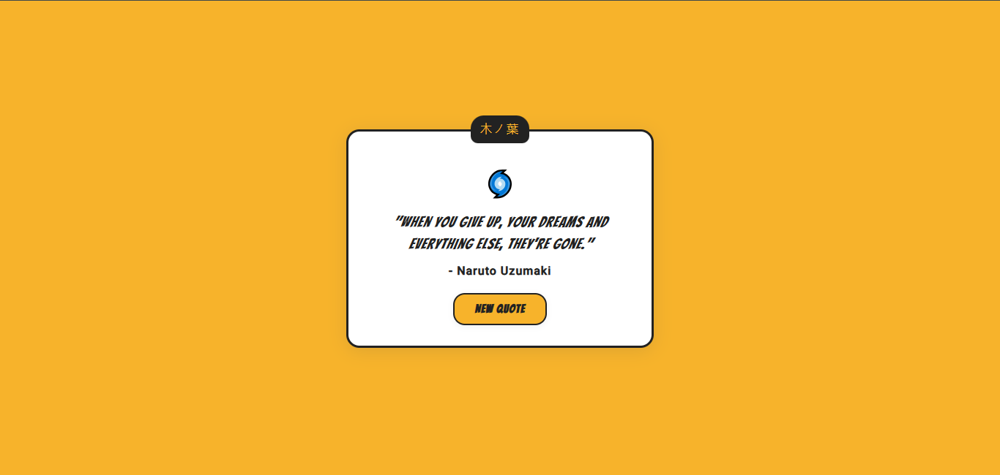
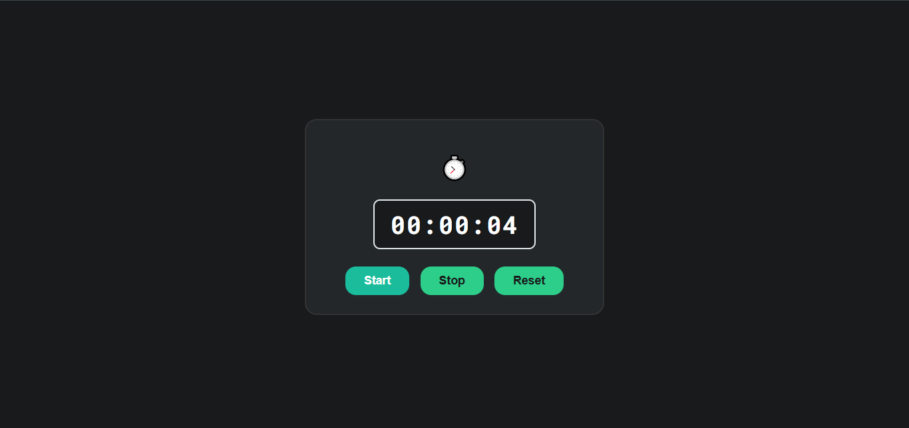
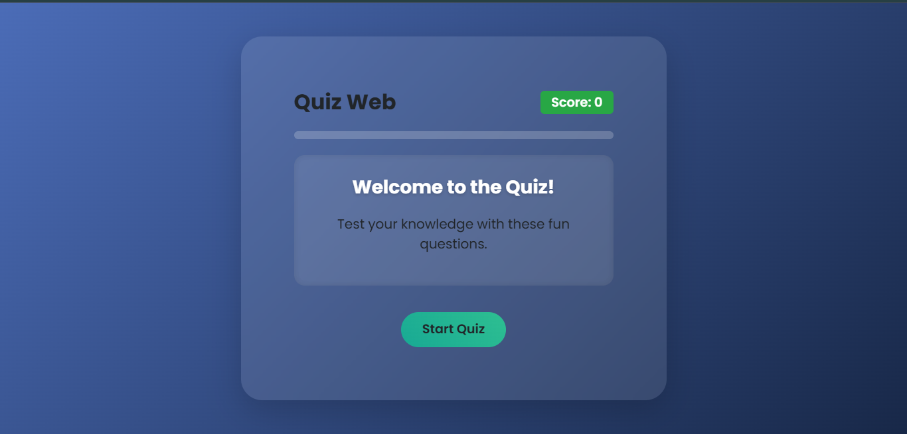

# JavaScript Mini Projects — Modern UI Collection

A curated set of small, polished front‑end projects built with HTML, CSS (Bootstrap), and vanilla JavaScript. Each project focuses on clean UI, smooth UX, and simple, readable code.

- Tech: HTML, CSS (Bootstrap 5), JavaScript
- Status: Ready to use

## Projects

---

### 1) Download Progress Bar (Start • Stop • Reset)

A clean download progress simulator with an eye‑catching UI. Start, pause, and reset with proper button states and smooth transitions.

- Live Demo: [Try Download Bar!](https://eclectic-croquembouche-b05e50.netlify.app/)

- Features:
  - Start/Stop (pause) and Reset controls
  - Smooth animation with randomized increments
  - Disabled button states prevent multiple intervals
  - Completion message + success styling

---

### 2) Naruto Quote App

A simple, attractive Naruto‑themed quote generator. Loads a random quote on page load and on button click with a subtle fade‑in.

- Live Demo: [Get a Naruto Quote!](https://lucky-bombolone-e22db2.netlify.app/)

- Features:
  - Random quotes (no immediate repetition using a `lastIndex` guard)
  - Smooth fade‑in animation
  - Naruto‑style UI (headband, fonts, colors)
  - Responsive card layout

---

### 3) Simple Stopwatch (Dark Theme)

A minimal, eye‑friendly dark stopwatch. Start, Stop, and Reset with a clear HH:MM:SS display and a digital monospace font.

- Live Demo: [Start Stopwatch!](https://dazzling-conkies-f75876.netlify.app/)

- 

- Features:
  - Start, Stop, Reset controls
  - HH:MM:SS with zero‑padding
  - Prevents multiple timers via a `running` flag
  - Dark, modern, responsive UI

---

### 4) Minimal Quiz

A minimal, eye‑protective quiz with a glass card, per‑question countdown, and clear feedback (correct/wrong). Timer bar shifts color as time runs out.

- Live Demo: <[Play Quiz Now!!!](https://deft-strudel-beb96e.netlify.app/)>

- Features:
  - Flow: Start → Question → Answer/Timeout → Next
  - 12s per question countdown (progress bar)
  - Correct/wrong highlighting, disabled options after selection
  - Live score and “Question X of N”

---
